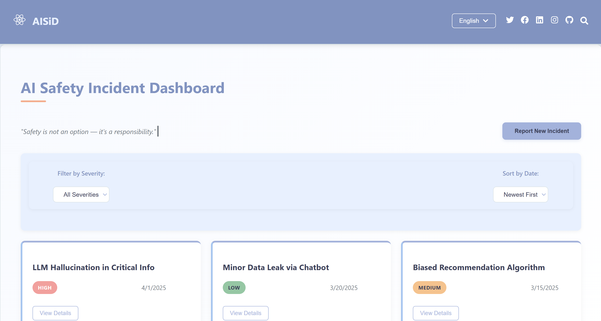

# AI Safety Incident Dashboard



A responsive web application for tracking and managing AI safety incidents, featuring filtering, sorting, and reporting capabilities.

## Features

- View, filter, and sort AI safety incidents by severity and date
- Report new incidents with title, description, and severity level
- Responsive design that works on all devices
- Modern UI with interactive elements and animations

## Technologies Used

- **Frontend**: React.js (v18+)
- **Styling**: CSS with custom properties (variables)
- **Icons**: React Icons (Font Awesome)
- **State Management**: React Hooks (useState)

## Getting Started

### Prerequisites

- Node.js (v16 or higher)
- npm (v8 or higher) or yarn

### Installation

1. Clone the repository:
   
   ```bash
   git clone https://github.com/your-username/ai-safety-dashboard.git
   cd ai-safety-dashboard
3. Install dependencies:
   
   npm install
   
# or

yarn install

3. Start the development server:

npm start

# or

yarn start

4. Open your browser and visit:
   
   http://localhost:3000

### Contributing

Contributions are welcome! Please open an issue or submit a pull request.

### License

This project is licensed under the MIT License - see the LICENSE file for details.


### Notes for customization:

1. Replace `your-username` with your actual GitHub username in the clone command
2. Add a screenshot named `screenshot.png` in your project root after taking one
3. Update the license if you're not using MIT
4. Add any additional sections you might need (like deployment instructions)
5. Include any environment variables if your project requires them

This README provides:
- Clear installation instructions
- Technology stack information
- Project structure overview
- Key design decisions
- Basic usage information
- Contribution guidelines

You can further customize it by adding:
- Demo link (if deployed)
- Badges for build status, license, etc.
- More detailed documentation if needed
- Acknowledgments section
